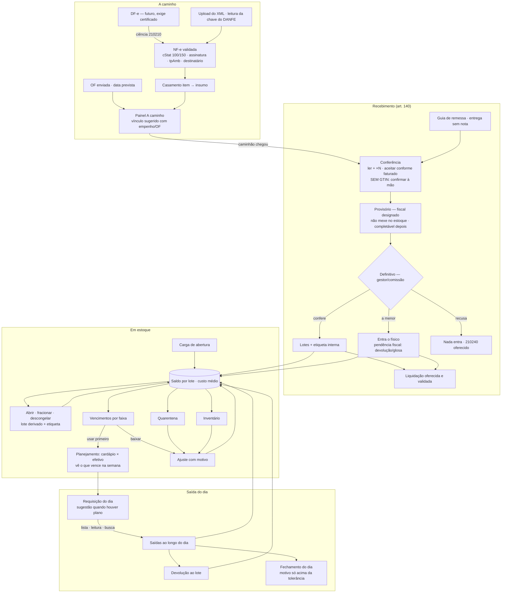

# Design: sisub-inventory-operations

## Contexto

Base existente (change `sisub-inventory-cycle`, arquivado): `inventory.stock_movement` append-only com
trigger, `stock_lot` com validade, `stock_cost` (custo médio), `goods_receipt` provisório → definitivo
com `goods_receipt_item_lot`, `nfe_document`/`nfe_item` com matching GTIN → `supplier_product_map` →
trigram, `register_production_issue`, `confirm_inventory_count`, `close_month`, telas em
`apps/sisub/src/routes/_protected/_modules/storage/$kitchenId/`, guard `requireStorageForKitchen`.
Em produção: **0 linhas** em todo o módulo — mudar contrato de função SQL e remover coluna é barato agora.

Artefatos de apoio nesta pasta: `benchmark.md` (comparativo com food service, ERP e setor público) e
`review.md` (achados das quatro revisões adversariais e onde cada um foi tratado).

Premissas de ambiente verificadas: banco com `TimeZone = UTC`; 30 cozinhas para 29 unidades de compra;
`Permissions-Policy` do sisub já libera `camera=(self)`; nenhuma tool de IA/MCP lê `inventory`.

## O fluxo alvo

1. **A caminho** — o sisub sabe o que foi pedido e o que foi faturado antes do caminhão; sem certificado,
   a partir do DANFE.
2. **Recebimento** — conferir é ler o que tem código e confirmar à mão o que não tem, sem segurar o
   caminhão: exceções agora, detalhes depois. Só o definitivo, por quem tem designação, mexe no estoque.
3. **Em estoque** — o saldo é a soma do ledger; tudo que não é recebimento nem produção entra por
   documento com motivo. Lote suspeito sai da alocação na hora (quarentena), antes da aprovação.
4. **Saída** — a produção **sugere**, o almoxarife **decide**; a explicação do desvio é pedida uma vez,
   no fim do dia.

## Decisões

### D1 — Captura de NF-e em três camadas; a terceira depende do certificado

**(a)** Upload de XML (existe). **(b)** Leitura da **chave de acesso** do DANFE (ou digitação): cria a
nota `announced` com emitente, modelo, série, número e **mês de emissão** extraídos da chave; como a
chave não traz o destinatário, a nota herda a unidade de compra da cozinha onde foi lida, marcada
"destinatário não confirmado" até o XML. **(c)** Coletor `NFeDistribuicaoDFe` — capability própria,
**parada**: a OM **não tem certificado digital** (Q1 respondida em 2026-09-17).

Enquanto não houver certificado, **(b) é o caminho de produção** e o "a caminho" é o que a OM já sabe
(OF enviada, entrega sem nota) mais a nota anunciada pela chave. É menos do que o pedido original — a
nota emitida antes de o caminhão sair só aparece com DF-e —, e é o máximo possível sem certificado.

A chave e o CNPJ são **alfanuméricos** desde a NT 2025.001 (posições 7–20 `[A-Z0-9]`, DV módulo 11 com
valor ASCII − 48; código de barras do DANFE alterna CODE-128C e CODE-128A). O emitente pode ser CPF
(produtor rural). Tudo que valida CNPJ ou chave usa uma única função do domínio.

**A raiz de CNPJ é única para o COMAER inteiro** (00.394.429/…): as OMs são filiais, com UASG distintas.
Três consequências, todas de governança e nenhuma contornável por código:
- um certificado da raiz enxergaria as notas de **toda a Força**, não as da OM — o corte por unidade
  seria só do sisub, o que é responsabilidade pesada para assumir sozinho;
- um `cStat 656` (consumo indevido) bloqueia a **raiz**, isto é, qualquer outro sistema do COMAER que
  consulte DF-e no mesmo CNPJ — inclusive os que não conhecemos;
- por isso o coletor, se um dia existir, é **um só para a FAB**, com cursor de NSU compartilhado, e não
  um por OM. Um coletor por OM garante `656` no primeiro dia.

Recomendação: antes de qualquer certificado, confirmar com quem administra o e-CNPJ da raiz se já há
consumo de DF-e (SILOMS, SIAFI, terceirizado). A alternativa intermediária, sem certificado e sem raiz,
é combinar com os fornecedores o envio do XML para uma caixa postal da OM e importar dali — o XML é do
destinatário por obrigação do emitente, e isso não depende de certificado nenhum.

**Regras do coletor (se um dia houver certificado).** Roda como **ECS scheduled task separada**, fora do
`apps/api` público, com task role própria; certificado PFX no Secrets Manager, convertido a PEM em
memória, cadeia ICP-Brasil em `ca`, nunca `rejectUnauthorized: false`. Exclusão mútua por **lease com
fencing** em `nfe_dfe_cursor` (`update … where lease_until < now() returning`) e avanço de `ult_nsu` por
compare-and-set — advisory lock de sessão não sobrevive ao pooler e a deploy rolling. `distNSU`
sequencial; após `137` espera ≥ 60 min; `656` para e alerta; cursor parado > 30 dias alerta (janela
SEFAZ de 90 dias).

**Descartado.** Portais comerciais (entregam a chave privada do órgão a terceiro); Portal da
Transparência (atraso).

### D2 — Autenticidade antes de valor

São duas camadas, e confundir uma com a outra foi o erro da primeira versão deste texto.

**Coerência do arquivo (implementada).** `mod = 55`; `tpAmb = 1`; `protNFe/infProt/cStat ∈ {100, 150}`
(150 = autorizada fora de prazo, válida, sinalizada); `infProt/chNFe` = `infNFe@Id`; `infProt/digVal` =
`DigestValue` da assinatura. Tudo é lido do PRÓPRIO arquivo e nada é recalculado: pega erro, nota de
homologação e protocolo colado de outra nota — e **não** pega adulteração deliberada. Um `cStat` editado
de 110 (denegada) para 100 passa, porque `infProt` fica fora do que a assinatura da nota cobre; `vProd`
ou `qCom` editados passam, porque o digest do `infNFe` não é recalculado (exige C14N). O resultado fica
gravado na nota como coerência, nunca como "autêntica".

**Autenticidade (pendente — tarefa 3.3).** Assinatura XMLDSig com C14N e cadeia ICP-Brasil do emitente.
Até ela existir, a única verificação real da cadeia é a **consulta de situação na SEFAZ** abaixo, e por
isso ela é exigida — autorizada e com no máximo 3 dias — antes de efetivar o definitivo e antes de
registrar a liquidação.

**Cancelamento posterior (110111).** Sem DF-e: antes de efetivar o definitivo e antes de registrar a
liquidação, o operador registra a **consulta de situação** (data, autor, situação) no portal da SEFAZ —
atalho montado com a chave. Com DF-e: eventos de cancelamento distribuídos atualizam a nota.

### D3 — Ciclo de vida da NF-e

Gravados: `announced`, `available`, `cancelled`, `refused`. Derivados (view): `in_receipt` (recebimento
não efetivado), `received` (definitivo **ou** divergente), `liquidated` (Σ liquidações vinculadas ≥ valor
recebido). `refused` só por recusa total.

**Manifestação** (só se DF-e ativo; sem DF-e, registro manual do evento feito fora): recusa total →
oferecer `210240` (prazo de 180 dias da autorização, com alerta); nota não reconhecida → `210220`;
definitivo → oferecer `210200` (impede cancelamento pelo emitente). `210210` automática não é aceite.

### D4 — Recebimento com ou sem NF-e

`goods_receipt.source` ∈ `nfe | delivery_note | ad_hoc` (NF-e, guia de remessa, entrega avulsa). Sem nota,
as linhas vêm do catálogo por leitura ou busca, com custo pelo empenho/ATA. A NF-e pode ser **vinculada
depois**, e várias entregas podem fechar contra uma nota (Σ recebido por linha comparado com a nota ao
vincular). Recebimento sem nota vinculada aparece em "A caminho" como "entrega sem nota" e não é liquidável.

### D5 — Conferência que não segura o caminhão

Casamento de leitura com a linha: `cEAN` → `cEANTrib` → alias/GTIN do insumo casado → hierarquia de
embalagem. Fator em `uCom`: ler cEAN soma 1; ler cEANTrib soma `qCom/qTrib`. AI 310n–315n soma o peso
lido. Conversão para base pela regra do matching (conteúdo líquido, nunca `uCom`).

Atalhos: **ler uma + ×N** (sugere o restante faturado); **aceitar conforme faturado** para as linhas não
tocadas (evento `bulk_confirm`), deixando só as exceções; **validade padrão por item** (dias a partir do
recebimento) para hortifrúti; campo de **temperatura** em linha perecível. O **provisório** pode ser
completado (lote, validade, local, etiqueta) depois que o caminhão sai; só o definitivo congela.

Eventos (`receipt_scan_event`, append-only): `client_event_id` UNIQUE gerado no cliente, `seq bigserial`,
`method` (`scanner | camera | manual_confirm | typed | bulk_confirm`), `reversed_event_id` UNIQUE
(estorno único), sobrescrita com `based_on_seq` (recusada se houver evento posterior). A efetivação
**recalcula** as quantidades a partir dos eventos dentro da transação — uma fonte de verdade.
Imutabilidade após efetivação por **trigger** em `goods_receipt_item`, `_lot` e `receipt_scan_event`
(`select … for share` do recebimento), não só na API.

Leitura desconhecida associada a uma linha grava **alias** em `gs1_integration.gtin_alias` (GTIN →
`ingredient_item`, `status = pending`, autor, fornecedor): vale imediatamente para a cozinha e para notas
do mesmo fornecedor, e entra na fila de revisão `global` para virar GTIN do catálogo. `storage` nível 2
**não** escreve em `ingredient_item.gtin` (hoje exige `global` 2, e a coluna é única: sobrescrever quebraria
as notas antigas).

Tolerância de quantidade por `purchase_item` (default 2 %). **Divergência fiscal:** recebido abaixo do
faturado — mesmo dentro da tolerância — deixa o recebimento com **pendência fiscal** até vincular NF-e de
devolução do fornecedor (`finNFe = 4`, chave), nota substituta ou **glosa** registrada; carta de correção
não altera quantidade nem valor.

### D6 — Competência de quem recebe (Decreto 11.246/2022, art. 25; Lei 14.133, arts. 117 e 140)

`procurement.contract_designation`: empenho ou ARP/contrato, pessoa, papel (`manager`,
`technical_inspector`, `administrative_inspector`, `sectoral_inspector`, `committee_member`, com
substitutos), **fonte** (`ato` — boletim/portaria; `empenho` — o próprio empenho designa; `permanente` —
ato permanente da OM para recebimento de gêneros), identificação da fonte e vigência. Provisório exige
fiscal designado vigente; definitivo exige gestor ou membro de comissão. Fonte `empenho` cobre o caso
comum em que o empenho já nomeia o responsável (Q3), e a designação permanente cobre entrega sem
empenho. PBAC `storage` continua pré-condição; a designação é a fonte da competência. A checagem é feita no servidor (o PBAC só existe em TS) e gravada no recebimento. O termo
mostra papel e ato de designação.

### D7 — Segregação, alçada e o que o SQL realmente garante

Server functions usam service role: `auth.uid()` é nulo e o PBAC só existe em TS. Então: o servidor
resolve o ator e passa `p_actor` às RPCs, que checam autoria (`p_actor <> created_by`, não é autor de
lançamento) contra dados do banco. "Existe outra pessoa elegível" é decidido no servidor. As RPCs de
`inventory` ficam **SECURITY INVOKER** com `revoke execute … from public, anon, authenticated` — se
alguém criar uma DEFINER exposta, `p_actor` vira spoofável pelo `/rpc`. Trigger em `stock_movement`
exige `current_setting('inventory.via_rpc', true)` definido pelas RPCs, porque a regra opengrep não
alcança a service role.

Segregação é **configurável por cozinha** (`kitchen_stock_settings.segregation`): `strict` (aprovador ≠
autor ≠ quem contou) ou `dual` (duas pessoas quaisquer). Sem segunda pessoa disponível, a operação
**prossegue** com `approval_exception_reason` e entra no relatório de exceções do gestor — travar a
cozinha no sábado não é controle, é convite ao contorno. **Exceção não configurável:** inventário
`annual` e `responsibility_transfer` exigem comissão designada (IN SEDAP 205/88, 8.4), e provisório e
definitivo exigem designação (D6).

Alçada de ajuste é calculada **no SQL**, sob a trava de custo, somando ajustes do mesmo item e autor em
24 h (fatiar R$ 900 em 5 × R$ 180 não escapa). Default R$ 500 (uma caixa de proteína), por cozinha.

### D8 — Tempo: `occurred_at` separa o fato do lançamento

`stock_movement.occurred_at` (instante físico; default `now()`; retroativo permitido **no mesmo dia** em
Brasília e nunca antes de contagem aprovada do item) convive com `created_at` (lançamento). Saldo em
instante, competência mensal, lock de período e contagem usam `occurred_at`, sempre com datas em
`America/Sao_Paulo` (o banco está em UTC; `date_trunc('month', created_at)` hoje joga 21h–24h do último
dia no mês seguinte).

### D9 — Custo médio sob trava e valoração

- BEFORE INSERT: `insert into stock_cost … on conflict do nothing` + `select … for update` — a primeira
  linha deixa de dar 23505 em corrida, e leitura e recálculo ficam serializados por cozinha × item.
- Entradas sem custo explícito (`adjustment_in` com `found_stock`, `count_gain`, `entry_error_in`) entram ao
  **custo médio**; média zero (item nunca recebido) → último custo de recebimento → sem nenhum, recusa
  pedindo custo.
- `issue_return` entra ao **custo médio ponderado das saídas daquele lote pela requisição**.
- `transfer_in` entra ao `unit_cost` do `transfer_out`.
- `leftover_return` de preparação congelada segue a R$ 0 (custo já apropriado nos insumos).
- Saldo ≤ 0 antes de uma entrada: a média passa a ser o custo da entrada (não `(0 + 60)/8`).
- **Custo do item da NF-e** = (`vProd − vDesc + vFrete + vSeg + vOutro + vIPI + vST + vFCPST`) ÷
  quantidade base; invariante Σ itens = `vNF` (diferença de arredondamento na maior linha). Nota
  complementar (`finNFe = 2`) ajusta valor, sem quantidade.

### D10 — Alocação de lote dentro da transação

A alocação sai do TypeScript e vai para as RPCs (`issue_stock`, `transfer_stock`, `post_stock_adjustment`):
`select … from stock_lot where kitchen, item … order by id for update`, depois ordena por
`use_first desc, coalesce(expiry_date, data de recebimento em Brasília) asc, received_at asc, id asc`,
**ignorando** lote em quarentena e `expiry_date < hoje (Brasília)`. Lote sem validade concorre pela
**data de recebimento** no lugar da validade — não vai para o fim da fila (`nulls last` deixaria o lote
sem data parado para sempre atrás de qualquer lote datado). A mesma ordem é a do `sortFefo` da prévia no
TypeScript: prévia e alocação divergindo mostram um lote e baixam outro. Quando o item tem validade
padrão (D5), a validade estimada é gravada no lote e ele entra no FEFO normal. Saldo insuficiente não bloqueia: a falta vira movimento sem lote **e** alerta ao nível 3 com
regularização em até 7 dias (ajuste ou contagem). Toda emissão carrega `emission_id` UNIQUE gerado no
clique.

Lote vencido só sai por escolha explícita, nível 3 e motivo. Leitura GS1 ou de etiqueta de lote vencido
na saída abre esse fluxo em vez de alocar.

### D11 — Saída é a requisição do dia

`inventory.stock_issue_request`: cozinha, **data de retirada**, origem `production | ad_hoc`, status
`open → closed | closed_unexplained`. Itens: ingrediente, refeição opcional, `suggested_qty` (recalculável
enquanto aberta, **congelado no fechamento**), total emitido e devolvido derivados dos movimentos,
`variance_reason`. Sugestão = Σ tarefas cuja data de retirada (`issue_date`, default `production_date`) é o
dia — o descongelamento D-1 cai na requisição do dia anterior —, em quantidade bruta com fator de
correção, arredondada à embalagem de saída do item quando houver.

Cozinha que não planeja no sisub **não é bloqueada** (Q4): sem tarefas no dia a requisição aceita saída livre, sem variância. A cobertura de planejamento (dias com sugestão ÷ dias com saída) aparece no painel do gestor, para que a exceção seja visível sem virar obstáculo.

Emissões ao longo do dia são livres (a menor, a maior, fora da sugestão). **Motivo só no fechamento**, e
só para linhas com sugestão > 0 cujo desvio passa da tolerância **e** do piso absoluto (default 10 % e
R$ 20 ou 1 embalagem). Sem planejamento no dia, não há sugestão, variância nem motivo. Requisição não
fechada até 23:59 de Brasília fecha como `closed_unexplained` e aparece em pendências. Motivos:
`headcount_change`, `production_loss`, `yield_difference`, `recipe_substitution`, `portion_adjustment`,
`other` (texto).

Três modos na mesma requisição: lista sugerida; leitura (GTIN → ingrediente + alocação; GS1 com lote ou
etiqueta interna → aquele lote; soma o conteúdo da embalagem); busca manual. Saída avulsa (`ad_hoc`)
exige destino e motivo; **apoio a outra OM é transferência, não saída avulsa**; evento fora da
alimentação da tropa exige autorização registrada.

Devolução: ao lote de origem, limitada ao emitido líquido do lote pela requisição, sob a mesma trava;
saída sem lote não tem devolução ao lote.

A baixa pós-`DONE` atual vira "abrir a requisição do dia a partir das tarefas concluídas".

### D12 — Etiqueta interna e produto aberto (RDC ANVISA 216/2004, item 4.8.6)

Todo lote pode imprimir **etiqueta interna** (CODE-128 com o código curto do lote + texto: item, lote,
validade, local, entrada) em térmica 58/80 mm ou A4 pelo navegador — inclusive `SEM-LOTE`. Ler a
etiqueta identifica **o lote**, o que torna a leitura útil na saída e na contagem mesmo para produto de
varejo (EAN-13 sem lote) e hortifrúti.

Ação **abrir / fracionar / descongelar**: move quantidade do lote de origem para **lote derivado**
(`parent_lot_id`, `opened_at`, `derivation` ∈ `opened | portioned | thawed`) na mesma cozinha, com validade = mín(validade
original, agora + `shelf_life_after_opening_days` ou `shelf_life_after_thaw_days` do ingrediente),
imprimindo a etiqueta obrigatória (designação, data de manipulação, validade). Custo preservado. Não é
transferência (não altera saldo do item nem custo médio): é par `lot_split_out`/`lot_split_in`.

### D13 — Ajuste, quarentena e apuração

`stock_adjustment` (status `draft → pending_approval → posted | rejected`), itens (lote/item, direção,
quantidade, `reason_code`, `corrected_movement_id`, `measured_temperature_c`, observação), anexos,
`evidence_status` (`complete | pending`).

**Quarentena**: nível 2 marca `stock_lot.quarantined_at` imediatamente (sai da alocação e do disponível
do MRP). Aprovação pendente não deixa o lote suspeito ser sugerido. **Evidência** pode vir depois: o
ajuste abaixo da alçada é lançado com `evidence_status = pending` e aparece em pendências.

`waste` fica reservado a descarte de sobra de produção; todo o resto é `adjustment_in/out`.

| `reason_code` | Direção | Evidência | Aprovação | Natureza |
|---|---|---|---|---|
| `expired` vencido | saída | termo de inutilização acima da alçada | alçada | perda |
| `spoiled` deteriorado | saída | foto ou termo | alçada | perda |
| `damaged` avaria | saída | foto ou termo | alçada | perda |
| `cold_chain_failure` falha de refrigeração | saída | temperatura medida | sempre | perda |
| `sanitary_recall` recolhimento sanitário | saída | ato/aviso | sempre | perda |
| `lost` extravio | saída | comunicação; processo depois | sempre | em apuração |
| `theft` furto/roubo | saída | comunicação; BO/processo depois | sempre | em apuração |
| `quality_sample` amostra | saída | — | alçada | consumo |
| `supplier_return` devolução ao fornecedor | saída | chave da NF-e de devolução | sempre | redução de custo |
| `donation` doação | saída | termo + autorização do ordenador | sempre | doação |
| `entry_error_in` / `entry_error_out` | entrada / saída | movimento corrigido | sempre | correção |
| `count_gain` / `count_loss` | entrada / saída | contagem | pela contagem | inventário |
| `found_stock` achado | entrada | — | sempre | inventário |
| `opening_balance` carga de abertura | entrada | planilha/folha | pela abertura | implantação |
| `production_leftover_discard` | saída (`waste`) | — | não | consumo |

`lost` e `theft`: o saldo físico sai na hora; o valor fica **em apuração** até o número do processo
(sindicância/TCA) ser informado. Descarte acima da alçada exige termo de inutilização assinado por
comissão. A exportação SIAFI/SIADS mapeia cada natureza para evento contábil próprio (conta PCASP na Q2).

### D14 — Carga de abertura

Documento próprio (não é contagem): importação de planilha (item, quantidade, validade, local, lote) ou
folha a partir do catálogo filtrado por classe; custo preenchido em lote pela última ATA/pesquisa de
preço com "aceitar todos" e fonte registrada; não cega, sem recontagem, uma aprovação. Gera
`adjustment_in` com `opening_balance`, fora do relatório de perdas e ganhos. Só para itens sem nenhum
movimento anterior na cozinha.

### D15 — Contagem

Tipos (IN SEDAP 205/88, 8.1): `annual`, `responsibility_transfer`, `eventual`, `rotating` (a carga inicial é D14);
`annual` e `responsibility_transfer` exigem comissão. Escopos: `full` (itens da cozinha com saldo ou
já movimentados), `conservation_class`, `location`, `item_list`, `menu_cycle`. **Não sobreposição**: na
abertura materializa-se `count_scope_item(kitchen_id, item)` com índice único parcial para contagens
abertas — o grão é o item. Item que surge durante a contagem insere linha e colide, como deve. Contagem
aberta há mais de 7 dias expira.

**Cega** por padrão para nível 2: a folha não mostra saldo **e** a leitura de saldo dos itens da contagem
fica restrita a nível 3 enquanto ela está `counting` — sem isso a cegueira é só visual.

**Referência temporal**: diferença = `contado − saldo(occurred_at ≤ instante da contagem)`. Instante =
servidor quando online; offline, `device_at` **limitado** a [última sincronização, recebimento no
servidor] e corrigido pelo desvio de relógio medido na abertura da sessão; havendo movimento do item nesse
intervalo, a linha vai para recontagem.

Antes da aprovação, **recusa** se houver, para item do escopo, tarefa `DONE` sem requisição fechada no
período ou recebimento `provisional` — mercadoria física que o ledger ainda não viu gera perda ou ganho
em dobro.

**Grão item × lote**: linha "sem lote" de um item vale contra saldo sem lote + lotes do item não contados
individualmente.

Recontagem: linhas acima da tolerância (percentual **e** valor) vão para nova rodada, por outra pessoa em
`strict`, opcional em `dual`. Não contados: listados, zerados só com marcação explícita. Aprovação gera
ajuste `count_gain/count_loss` e regulariza saídas sem lote. Competência = data (Brasília) da contagem;
`close_month` recusa fechar mês com contagem em revisão contada naquele mês.

Offline (IndexedDB) só na folha de contagem, com `client_event_id` idempotente.

### D16 — Vencimentos

`expiry_alert_policy` resolvido por ingrediente na cozinha → classe na cozinha → ingrediente global →
classe global → default (resfriado 3, congelado 15, demais 30 dias). O ingrediente global entra antes da
classe global: sem ele, "leite: 2 dias" cadastrado para a Força inteira seria ignorado em favor dos 3 da
classe, sem aviso. A política global é da administração; a cozinha define e remove só a própria. Faixas: **Vencido**, **Crítico** (≤ limite), **Atenção**
(≤ 2 × limite). Ações: usar primeiro, transferir, baixar (`expired`), quarentena (para avaliar
`spoiled`, sem exigir foto de algo que ainda não estragou). Perecível sem validade listado à parte.
Aviso: badge no menu e bloco no painel, calculados na leitura (o sisub não tem canal de notificação),
**e bloco "vence até o fim da semana planejada" na tela de planejamento de cardápio** da cozinha.

### D17 — Leitor: campo focado primeiro, captura global calibrada

Caminho principal: **campo de leitura sempre visível e focado** nas telas de leitura. Complemento: hook
de captura global quando o foco não está em campo editável — desligado em buscas e inputs; os caracteres
de uma rajada detectada fora de campo **são descartados**, não devolvidos. Parâmetros **medidos** na tela
"Testar leitor" (intervalo entre teclas do leitor real, comprimento mínimo — EAN-8 e UPC-E têm 8 —,
terminador ou timeout sem terminador); default inicial 80 ms, o valor atual do `GtinScannerField`. GS1:
symbology identifier, `\x1D` e substitutos configuráveis. Câmera: `BarcodeDetector` ou `@zxing/browser`
sob demanda (o `qr-scanner` atual só lê QR).

**O perfil calibrado é gravado no banco, por usuário × cozinha — não em `localStorage`.** A intenção
original era "por estação", que é o recorte físico correto, mas chave nova de armazenamento local exige
**versão nova da Política de Cookies** (linha nova em `iefa.legal_documents`, com ciência de todos os
usuários) por um dado que é preferência de periférico. O preço não se justifica: quem opera uma estação
é quase sempre a mesma pessoa, e o perfil no banco ainda atravessa troca de máquina e reinstalação de
navegador. Se algum dia uma estação for compartilhada por operadores com leitores diferentes, a saída é
um rótulo de estação escolhido na tela — e continua sem tocar no navegador.

### D18 — Configuração por cozinha

`inventory.kitchen_stock_settings` (PK `kitchen_id`): `segregation`, `adjustment_approval_value`,
`issue_tolerance_pct`, `issue_tolerance_floor_value`, `count_tolerance_pct`, `count_tolerance_value`.
`stock_policy` segue por cozinha × ingrediente (ponto de pedido). Tolerância de quantidade no recebimento
fica em `purchase_item`. Validade padrão e prazos após abertura/descongelamento ficam no `ingredient`.

### D19 — Liquidação

Vínculo único: `finance.liquidacao.goods_receipt_id` (N liquidações por recebimento já cabem);
`goods_receipt.liquidacao_id` é removida e a view de conciliação ajustada. `createLiquidacaoFn` valida
unidade, status efetivado, empenho, pendência fiscal e **atestado de situação da nota** (D2); o `update`
cego que hoje grava em recebimento de qualquer unidade some. Valor abaixo da nota exige glosa registrada;
acima do recebido é aceito e sinalizado. Painel mostra os **dias úteis desde o recebimento da nota fiscal
pela Administração** contra o prazo de liquidação — 10 dias úteis (IN SEGES/ME 77/2022, art. 7º, I). O
termo inicial é a NOTA, não o definitivo: entrega sem nota ainda não conta prazo, e a nota semanal do pão
começa a contar quando chega. O §2º reduz o prazo à metade nas contratações de valor até o limite que
ele fixa, e o §4º exclui da contagem o tempo de saneamento da documentação fiscal — a pendência fiscal
aberta suspende o relógio em vez de consumi-lo. Liquidação é verificação do direito do credor (Lei 4.320,
art. 63): o sisub oferece e valida, nunca cria.

### D20 — LGPD e armazenamento local

O perfil do leitor vai para o banco (D17), então **nenhuma chave nova de `localStorage`**. O que resta
no navegador é o banco IndexedDB da fila de contagem offline, que entra no inventário da Política de
Cookies **antes** do uso — o teste de inventário não enxerga IndexedDB, então a entrada é manual e
revisada. Fotos de evidência podem conter pessoas e documentos de apuração contêm
dados de terceiros: bucket privado **sem policy de cliente**, autorização pelo registro no banco
(`adjustment.kitchen_id`), upload por URL assinada de upload com tipo por magic bytes e limite de
tamanho, remoção de EXIF/GPS, URL de leitura com TTL ≤ 300 s e não persistida, retenção definida e
declarada em `LGPD.md` e na Política de Privacidade.

### D21 — Convivência com SILOMS e SIAFI, com o mínimo de digitação

O almoxarifado de subsistência é escriturado hoje no SILOMS e no SIAFI; a intenção declarada é que o
sisub venha a substituir o SILOMS nessa parte. Isso define o desenho em dois tempos:

- **Agora — espelho, não substituto.** O sisub é o sistema **operacional** (é nele que se recebe, baixa,
  conta e ajusta) e gera o **espelho** do período para lançamento no SILOMS: um arquivo por competência,
  agrupado por item de catálogo e por natureza de movimento (entrada por compra, saída por consumo,
  perda, em apuração, doação, transferência, ajuste de inventário), com quantidade, valor a custo médio e
  documento de origem. Os relatórios do sisub seguem rotulados **gerenciais** enquanto o SILOMS for a
  escrituração.
- **O formato do arquivo é parametrizado, não chumbado.** Ninguém sabe ainda como o pessoal do SILOMS
  prefere ingerir (planilha para digitação assistida, CSV, carga). Então o exportador tem um **mapa de
  colunas e de códigos de natureza** configurável (uma tabela, não código), com um perfil default
  "planilha de digitação" e espaço para outros perfis. Trocar o layout depois é editar o perfil.
- **Menos digitação é requisito, não enfeite.** O caminho de menor interferência é: o dado nasce uma vez
  na operação (leitura no recebimento, leitura na saída) e a competência inteira vira um arquivo. Nada de
  digitar de novo no sisub o que já está no SILOMS, nem o contrário.
- **Substituir o SILOMS é decisão fora deste change.** O que este change garante é que a substituição
  seja possível sem reescrever o ledger: histórico completo, valoração MCASP, motivo tipado por natureza
  e exportação isolada em `siafi_integration`.

## Riscos e trade-offs

- **Escopo grande.** Fases ordenadas por adoção; o piloto começa após a Fase 4.
- **Designação (D6) depende de cadastro que não existe.** Sem ela, provisório e definitivo ficam
  bloqueados — o cadastro é tarefa do piloto.
- **Validação de assinatura XMLDSig** exige biblioteca e cadeia ICP-Brasil atualizada no `apps/api`.
- **`occurred_at` retroativo** abre espaço para lançamento "no passado"; limitado ao mesmo dia e bloqueado
  antes de contagem aprovada.
- **Tolerâncias e alçada default** são calibráveis por cozinha e revistas após o piloto.

## Questões — respostas do mantenedor (2026-09-17)

- **Q1 — Certificado para DF-e: NÃO existe hoje.** A raiz de CNPJ é do COMAER inteiro (00.394.429/…),
  com UASG distintas por OM. Consequência aplicada em D1: o coletor sai do caminho de produção, a captura
  vive da chave do DANFE, e um eventual coletor futuro é **um só para a Força**, nunca um por OM.
- **Q2 — Escrituração: SILOMS + SIAFI**, com intenção de o sisub substituir o SILOMS e reduzir digitação
  ao mínimo. Aplicado em D21: espelho por competência com layout parametrizado; relatórios gerenciais
  enquanto o SILOMS for o oficial.
- **Q3 — Designação: o empenho pode substituir o ato** nas situações comuns. Aplicado em D6: a designação
  tem fonte `ato | empenho | permanente`.
- **Q4 — Planejamento: idealmente sim, mas sem travar.** Aplicado em D11: sem plano, saída livre e sem
  variância; a cobertura de planejamento vira indicador do gestor.
- **Q5 — Doação permitida.** Aplicado em D13: `donation` habilitado, exigindo termo e autorização do
  ordenador.

### Ainda aberta

- **Q6 — Norma de subsistência do COMAER** (inventário, perda, sindicância): o mantenedor vai levantar.
  Até lá valem IN SEDAP 205/88 e Lei 14.133; D13 e D15 podem precisar de ajuste fino depois.
- **Q7 — Layout de ingestão do SILOMS** (derivada da Q2): perguntar ao pessoal que opera o SILOMS qual
  formato aceita menos retrabalho. Até a resposta, vale o perfil default de planilha.
