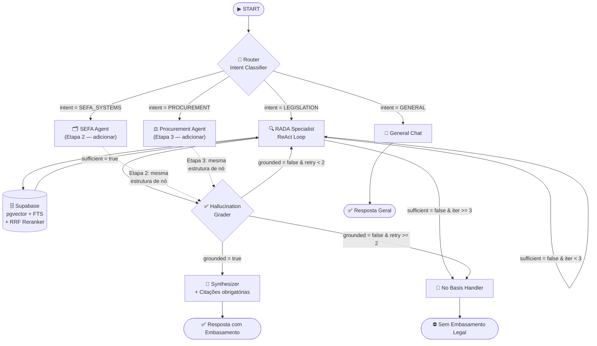

# 🏛️ ATLAS — Plataforma de Inteligência para Contratações da FAB

> **Stack:** Bun · Hono · LangGraph.js · Supabase (self-hosted) · LangSmith
> **Princípio:** A IA nunca afirma embasamento onde não existe. Na dúvida, não tem.

---

## Escopo deste Planning

Este documento cobre a **Fase 1 — Módulo ACI**, com foco total nas **Etapas 1 e 2**:

| Etapa | Entrega | Status |
|---|---|---|
| **1** | **ChatRADA** — RAG híbrido sobre o RADA | 🎯 MVP |
| **2** | **ChatSistemasSEFA** — RAG + Knowledge Graph sobre sistemas internos | 🔜 Próxima |
| 3–13 | Módulos subsequentes | 🔒 Fora do escopo atual |

> **Filosofia de extensibilidade:** cada nova etapa é uma *adição* de nó, tool ou coleção. O grafo, o estado e o schema nunca precisam ser refatorados — apenas expandidos.

---

## 1. Diagrama do Grafo (LangGraph)

O grafo é desenhado para suportar múltiplos agentes especialistas. O MVP ativa apenas o `rada_agent`. As etapas seguintes adicionam nós sem alterar a estrutura.



**Regra de extensão:** para adicionar um novo agente especialista, basta:
1. Criar o nó em `src/graph/nodes/`
2. Adicionar a aresta condicional no `Router`
3. Registrar a nova `Intent` no `AgentState`

---

## 2. Estado Global Canônico (`AgentState`)

Fonte única da verdade. Todos os nós leem e escrevem neste contrato.

```typescript
import { BaseMessage } from "@langchain/core/messages";

// ─── Tipos de suporte ────────────────────────────────────────────────────────

type Intent =
  | "LEGISLATION"      // Etapa 1: ChatRADA
  | "SEFA_SYSTEMS"     // Etapa 2: ChatSistemasSEFA (slot reservado)
  | "PROCUREMENT"      // Etapa 3: ChatLicitações (slot reservado)
  | "GENERAL"
  | "GREETING"
  | "UNKNOWN";

type DocumentType = "RADA" | "RBHA" | "ICA" | "MCA" | "NSCA";

type TerminationReason =
  | "success"
  | "no_documents_found"
  | "low_relevance_score"
  | "hallucination_detected"
  | "max_iterations_reached"
  | "max_retries_reached";

interface DocumentMetadata {
  source: string;           // "RADA-2023.md"
  document_type: DocumentType;
  chapter: string;          // "Capítulo IV"
  article: string;          // "Art. 42"
  section?: string;
  year: number;
  page: number;
}

interface RelevanceScores {
  semantic_score: number;   // 0–1: cosine similarity (pgvector)
  keyword_score: number;    // 0–1: BM25/FTS normalizado
  rerank_score: number;     // 0–1: score final pós-RRF
}

interface RetrievedDocument {
  id: string;
  content: string;
  metadata: DocumentMetadata;
  scores: RelevanceScores;
}

interface GroundingCheck {
  is_grounded: boolean;
  ungrounded_claims: string[];  // frases sem suporte nos docs
  confidence: number;           // 0–1
}

// ─── Estado principal ────────────────────────────────────────────────────────

interface AgentState {
  // Sessão
  messages: BaseMessage[];
  session_id: string;
  user_id?: string;

  // Classificação
  intent: Intent;
  original_query: string;
  reformulated_query?: string;  // reescrita pelo self-correction loop

  // Recuperação
  retrieved_documents: RetrievedDocument[];
  has_sufficient_context: boolean;
  min_rerank_threshold: number;  // default: 0.45

  // Validação
  grounding_check?: GroundingCheck;
  generated_response_draft?: string;

  // Controle de loop
  retrieval_iterations: number;  // máx: 3
  grading_retries: number;       // máx: 2

  // Resultado
  termination_reason?: TerminationReason;
  final_response?: string;
  cited_documents: string[];     // IDs dos docs — obrigatório na resposta final

  // Extensão futura (Etapa 2+): slots tipados, não usados no MVP
  graph_context?: KnowledgeGraphContext;       // Etapa 2
  document_processing?: DocumentProcessingState; // Etapa 4+
}

// ─── Slots de extensão (interfaces vazias — preenchidas nas etapas futuras) ──

interface KnowledgeGraphContext {
  entities?: GraphEntity[];
  relations?: GraphRelation[];
}

interface DocumentProcessingState {
  input_document?: string;
  extracted_json?: Record<string, unknown>;
  violations?: unknown[];
}

interface GraphEntity {
  id: string;
  label: string;
  type: string;
  properties: Record<string, unknown>;
}

interface GraphRelation {
  source_id: string;
  target_id: string;
  type: string;
  weight?: number;
}
```

### Regras de negócio do estado

| Campo | Regra |
|---|---|
| `has_sufficient_context` | `true` somente se ≥1 doc com `rerank_score >= 0.45` |
| `cited_documents` | Obrigatório. Resposta sem citação = bloqueada |
| `termination_reason` | Sempre preenchido — auditável via `query_logs` |
| `graph_context` | `undefined` no MVP. Etapa 2 preenche sem alterar o estado base |

---

## 3. Schema do Banco de Dados (Supabase Self-Hosted)

### 3.1 `documents` — Catálogo de documentos ingeridos

```sql
CREATE TABLE documents (
  id            UUID PRIMARY KEY DEFAULT gen_random_uuid(),
  source        TEXT NOT NULL,
  document_type TEXT NOT NULL
    CHECK (document_type IN ('RADA','RBHA','ICA','MCA','NSCA')),
  year          SMALLINT NOT NULL,
  title         TEXT NOT NULL,
  ingested_at   TIMESTAMPTZ NOT NULL DEFAULT now(),
  metadata      JSONB NOT NULL DEFAULT '{}'
);
```

### 3.2 `document_chunks` — Chunks com embedding e FTS

```sql
CREATE EXTENSION IF NOT EXISTS vector;

CREATE TABLE document_chunks (
  id          UUID PRIMARY KEY DEFAULT gen_random_uuid(),
  document_id UUID NOT NULL REFERENCES documents(id) ON DELETE CASCADE,

  content     TEXT NOT NULL,
  content_tsv TSVECTOR GENERATED ALWAYS AS (
    to_tsvector('portuguese', content)
  ) STORED,

  chapter     TEXT,
  article     TEXT,
  section     TEXT,
  page        INTEGER,
  chunk_index INTEGER NOT NULL,

  -- text-embedding-3-large (3072) ou nv-embed-v2 (4096)
  -- ajustar dimensão conforme modelo escolhido
  embedding   VECTOR(3072) NOT NULL,

  created_at  TIMESTAMPTZ NOT NULL DEFAULT now()
);

-- HNSW: melhor recall que IVFFlat, ideal para bases < 10M vetores
CREATE INDEX idx_chunks_embedding ON document_chunks
  USING hnsw (embedding vector_cosine_ops)
  WITH (m = 16, ef_construction = 64);

CREATE INDEX idx_chunks_fts        ON document_chunks USING GIN (content_tsv);
CREATE INDEX idx_chunks_document   ON document_chunks (document_id);
CREATE INDEX idx_chunks_article    ON document_chunks (article) WHERE article IS NOT NULL;
```

### 3.3 `knowledge_graph_nodes` — Grafo de conhecimento (Etapa 2)

> Usa Postgres puro via `ltree` + JSONB. Sem Neo4j. Self-host simples.

```sql
CREATE EXTENSION IF NOT EXISTS ltree;

CREATE TABLE knowledge_graph_nodes (
  id         UUID PRIMARY KEY DEFAULT gen_random_uuid(),
  label      TEXT NOT NULL,          -- "Sistema SEFA", "Módulo Financeiro"
  node_type  TEXT NOT NULL,          -- "system", "module", "process", "role"
  properties JSONB NOT NULL DEFAULT '{}',
  path       LTREE,                  -- hierarquia: "sefa.financeiro.pagamentos"
  created_at TIMESTAMPTZ NOT NULL DEFAULT now()
);

CREATE INDEX idx_kg_nodes_path ON knowledge_graph_nodes USING GIST (path);
CREATE INDEX idx_kg_nodes_type ON knowledge_graph_nodes (node_type);
```

### 3.4 `knowledge_graph_edges` — Relações do grafo (Etapa 2)

```sql
CREATE TABLE knowledge_graph_edges (
  id          UUID PRIMARY KEY DEFAULT gen_random_uuid(),
  source_id   UUID NOT NULL REFERENCES knowledge_graph_nodes(id) ON DELETE CASCADE,
  target_id   UUID NOT NULL REFERENCES knowledge_graph_nodes(id) ON DELETE CASCADE,
  relation    TEXT NOT NULL,         -- "DEPENDS_ON", "USED_BY", "MANAGED_BY"
  weight      FLOAT DEFAULT 1.0,
  properties  JSONB NOT NULL DEFAULT '{}',
  created_at  TIMESTAMPTZ NOT NULL DEFAULT now()
);

CREATE INDEX idx_kg_edges_source ON knowledge_graph_edges (source_id);
CREATE INDEX idx_kg_edges_target ON knowledge_graph_edges (target_id);
CREATE INDEX idx_kg_edges_relation ON knowledge_graph_edges (relation);
```

### 3.5 `langgraph_checkpoints` — Memória de sessão

```sql
CREATE TABLE langgraph_checkpoints (
  thread_id     TEXT NOT NULL,
  checkpoint_id TEXT NOT NULL,
  parent_id     TEXT,
  state         JSONB NOT NULL,
  created_at    TIMESTAMPTZ NOT NULL DEFAULT now(),
  PRIMARY KEY (thread_id, checkpoint_id)
);

CREATE INDEX idx_checkpoints_thread ON langgraph_checkpoints (thread_id, created_at DESC);
```

### 3.6 `query_logs` — Auditoria e dataset de eval

```sql
CREATE TABLE query_logs (
  id                   UUID PRIMARY KEY DEFAULT gen_random_uuid(),
  session_id           TEXT NOT NULL,
  original_query       TEXT NOT NULL,
  reformulated_query   TEXT,
  intent               TEXT NOT NULL,
  retrieved_doc_ids    UUID[],
  termination_reason   TEXT NOT NULL,
  final_response       TEXT,
  retrieval_iterations SMALLINT,
  grading_retries      SMALLINT,
  latency_ms           INTEGER,
  langsmith_run_id     TEXT,
  created_at           TIMESTAMPTZ NOT NULL DEFAULT now()
);

CREATE INDEX idx_query_logs_session     ON query_logs (session_id);
CREATE INDEX idx_query_logs_termination ON query_logs (termination_reason);
CREATE INDEX idx_query_logs_intent      ON query_logs (intent);
```

---

## 4. Ferramenta: `RADA_Retriever_Tool`

### Pipeline de busca híbrida

```
1. Semântica   → pgvector cosine similarity → top 10
2. Keyword     → Postgres FTS (portuguese)  → top 10
3. RRF Fusion  → score = Σ 1/(60 + rank_i)  → lista unificada
4. Reranker    → LLM-as-reranker (prompt cross-encoder) → top 5
5. Threshold   → remove docs com rerank_score < 0.45
```

### Input

```typescript
interface RADARetrieverInput {
  query: string;
  filters?: {
    document_type?: DocumentType;
    year_from?: number;
    year_to?: number;
    chapter?: string;
    article?: string;
  };
  top_k?: number; // default: 10
}
```

### Output

```typescript
interface RADARetrieverOutput {
  documents: RetrievedDocument[];  // ordenados por rerank_score DESC
  total_found: number;             // antes do threshold
  after_threshold: number;         // após o filtro — 0 = sem embasamento
  search_metadata: {
    semantic_count: number;
    keyword_count: number;
    fusion_method: "RRF";
    threshold_applied: number;
    query_used: string;
  };
}
```

> **Regra crítica:** se `after_threshold === 0` → `has_sufficient_context = false` → grafo vai direto para `NO_BASIS`. O Synthesizer nunca é chamado.

---

## 5. Self-Correction Loop

```
Iteração 1: query original
  └─ 0 docs relevantes → reformula (mais específica)

Iteração 2: query reformulada
  └─ 0 docs relevantes → reformula (sinônimos regulatórios)

Iteração 3: segunda reformulação
  └─ 0 docs relevantes → termination_reason = "max_iterations_reached"
                       → NO_BASIS_RESPONSE
```

**Prompt de reformulação:**
```
Você é especialista em legislação aeronáutica brasileira (RADA, RBHA, ICA).
A query "{original_query}" não retornou documentos relevantes.

Reformule para melhorar o recall:
- Use terminologia técnica aeronáutica (ex: "piloto" → "comandante")
- Considere artigos ou capítulos relacionados
- Não invente termos que não existem na legislação

Retorne APENAS a query reformulada.
```

---

## 6. Fallback Jurídico (`NO_BASIS_RESPONSE`)

```typescript
const NO_BASIS_MESSAGES: Record<TerminationReason, string> = {
  no_documents_found:
    "Não foi encontrada base normativa na legislação disponível.",

  low_relevance_score:
    "Os documentos encontrados não possuem relevância suficiente para embasar uma resposta. A legislação pode não tratar especificamente desta situação.",

  hallucination_detected:
    "Não foi possível gerar uma resposta verificável com base na legislação disponível. Por segurança jurídica, esta pergunta não pode ser respondida automaticamente.",

  max_iterations_reached:
    "Após múltiplas tentativas de busca, não foi encontrado embasamento normativo suficiente. Este tema pode não estar coberto pela legislação indexada.",

  max_retries_reached:
    "A resposta gerada não pôde ser verificada contra a legislação. Por princípio de conservadorismo jurídico, a resposta não será exibida.",

  success: "",
};
```

---

## 7. Estrutura de Pastas

```
apps/alpha/
├── src/
│   ├── index.ts                    # Hono app + rotas
│   ├── graph/
│   │   ├── state.ts                # AgentState — fonte da verdade
│   │   ├── graph.ts                # StateGraph + compile
│   │   ├── nodes/
│   │   │   ├── router.ts           # Intent classifier
│   │   │   ├── rada-agent.ts       # MVP: Etapa 1
│   │   │   ├── sefa-agent.ts       # Etapa 2 (adicionar)
│   │   │   ├── procurement-agent.ts# Etapa 3 (adicionar)
│   │   │   ├── grader.ts           # Hallucination grader
│   │   │   ├── synthesizer.ts      # Response + citações
│   │   │   ├── no-basis.ts         # Fallback jurídico
│   │   │   └── general-chat.ts
│   │   └── edges/
│   │       └── conditions.ts       # Lógica condicional das arestas
│   ├── tools/
│   │   ├── rada-retriever.ts       # Etapa 1: pgvector + FTS + RRF
│   │   └── graph-retriever.ts      # Etapa 2: knowledge graph queries
│   ├── ingest/
│   │   └── markdown-ingest.ts      # Markdown → chunks → embeddings → Supabase
│   ├── db/
│   │   ├── supabase.ts             # Client singleton
│   │   └── checkpointer.ts         # PostgresCheckpointSaver
│   └── prompts/
│       ├── router.ts
│       ├── rada-agent.ts
│       ├── grader.ts
│       ├── synthesizer.ts
│       └── reformulation.ts
├── docs/                           # Documentos fonte em Markdown (ingestão)
│   └── rada/
│       └── RADA-2023.md
├── business_explanation.md
├── planning.md
└── package.json
```

**Regra de extensão para novas etapas:**
- Nova coleção de documentos → adicionar pasta em `docs/` + nova tool em `src/tools/`
- Novo agente especialista → novo nó em `src/graph/nodes/`
- Nova intenção → adicionar `Intent` no `state.ts` + aresta no `router.ts`
- Nunca alterar `grader.ts`, `synthesizer.ts` ou `no-basis.ts`
- **Ingestão:** sempre via Markdown (`src/ingest/markdown-ingest.ts`). Sem dependência de Python ou PDF.

---

## 8. Stack Tecnológica

| Camada | Tecnologia | Justificativa |
|---|---|---|
| **Runtime** | Bun | Cold start mínimo, TS nativo, sem transpile |
| **API** | Hono | Leve, tipagem forte, middleware composável |
| **Orquestração** | LangGraph.js | Estado persistido, ciclos, extensível |
| **LLM** | LangChain.js (`@langchain/openai` compat.) | Troca NVIDIA NIM ↔ OpenAI sem refatorar o grafo |
| **Vector DB** | Supabase pgvector (HNSW) | Self-hosted, integrado ao Postgres |
| **FTS** | Postgres FTS (`portuguese`) | Busca por artigo/capítulo específico |
| **Knowledge Graph** | Postgres (`ltree` + JSONB) | Self-hosted, sem infra extra, suficiente para grafos hierárquicos |
| **Checkpoints** | PostgresCheckpointSaver | Time Travel, sessão persistida |
| **Ingestão** | TypeScript (`markdown-ingest.ts`) | Markdown como formato único; sem dependência Python ou PDF |
| **Observabilidade** | LangSmith + `query_logs` | Trace do grafo + auditoria interna |

---

## 9. Visualizador de Documentação Original

O chat contará com um painel lateral de visualização da documentação fonte, inspirado no modelo de detalhamento do NotebookLM. A ideia é que o usuário veja o trecho exato do documento que embasou a resposta — não apenas a citação textual no chat.

### Comportamento

- Ao receber uma resposta, o painel lateral exibe os **documentos fonte** utilizados (ex.: `RADA-2023.md`, `Capítulo IV — Art. 42`).
- O usuário pode clicar em cada citação e **navegar diretamente ao trecho** do documento, com o contexto destacado.
- O painel é **persistente** durante a sessão: o usuário pode navegar entre diferentes fontes sem perder o fio da conversa.
- Suporte a **múltiplos documentos** side-by-side quando a resposta cruzou fontes distintas.

### Interface

```
┌─────────────────────────────┬───────────────────────────────┐
│         Chat                │    Documentação Fonte         │
│                             │                               │
│  Pergunta do usuário...     │  📄 RADA-2023 — Cap. IV       │
│                             │  ─────────────────────────    │
│  Resposta com [¹][²]...     │  ...trecho destacado do       │
│                             │  art. 42 que embasou a        │
│  ¹ RADA Art. 42             │  resposta...                  │
│  ² RADA Art. 51             │                               │
│                             │  📄 RADA-2023 — Cap. VI       │
│                             │  ─────────────────────────    │
│                             │  ...trecho do art. 51...      │
└─────────────────────────────┴───────────────────────────────┘
```

### Implementação

- Os `cited_documents` do `AgentState` já carregam os IDs dos chunks — a API retorna o conteúdo e metadados completos desses chunks junto com a resposta.
- O frontend renderiza o Markdown do trecho original com highlight no fragmento relevante.
- Nenhuma lógica adicional no grafo: é uma feature puramente de apresentação alimentada pelos dados já existentes no estado.

---

## 10. Pontos de Atenção

| # | Risco | Mitigação |
|---|---|---|
| 1 | Latência do grafo (múltiplos turnos LLM) | Streaming de tokens. Frontend exibe estado: "Consultando RADA...", "Verificando embasamento..." |
| 2 | Custo de tokens em loops | `recursionLimit: 10`. `retrieval_iterations` máx 3. `grading_retries` máx 2 |
| 3 | Falso positivo jurídico | Dupla barreira: threshold 0.45 + Hallucination Grader |
| 4 | Drift do modelo de embedding | Versionar modelo em `documents.metadata`. Re-indexar ao trocar |
| 5 | Paridade LangGraph JS vs Python | Verificar [docs oficiais](https://langchain-ai.github.io/langgraphjs/) a cada release |